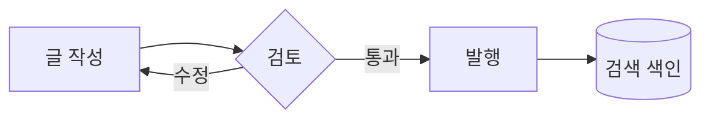
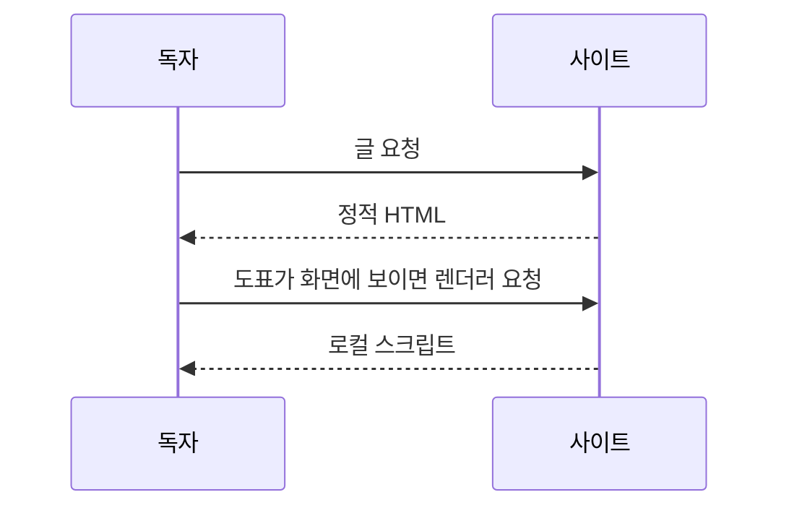

---
{
  "id": "example-markdown-guide",
  "slug": "markdown-guide",
  "type": "blog",
  "title": "Markdown으로 글 쓰는 법과 지원 문법",
  "description": "일반 Markdown만으로 글을 쓰는 방법과 지원하는 문법, 코드 블록 언어를 한 글에서 확인합니다.",
  "tags": [
    "programming-languages-runtime"
  ],
  "field": "languages",
  "topic": "programming-languages-runtime",
  "contentIcon": {
    "name": "document"
  },
  "visibility": "public",
  "comments": true,
  "example": true,
  "publishedAt": "2026-09-30",
  "author": "Posted by 예시 작성자"
}
---

일반 Markdown만으로 글을 쓰는 방법과 지원하는 문법, 코드 블록 언어를 한 글에서 확인합니다.

이 글은 작성 안내를 겸한 예시입니다. 실제 경험이나 성과를 담지 않았고, 아래 문법을 그대로 복사해 새 글에 붙여 넣어 쓸 수 있습니다. 화면 검증 전용이라 공개 사이트에서는 목록, 검색, 피드에 나타나지 않습니다.

## 글 파일 만들기

글은 `product/publication/` 또는 `product/examples/` 아래의 `.md` 파일 하나입니다. 파일 맨 위에 `---`로 감싼 JSON 또는 YAML 메타데이터를 쓰고, 그 아래에 본문을 씁니다.

```yaml
id: my-first-post
slug: my-first-post
type: blog
title: 글 제목
description: 목록과 검색, 글 맨 앞 도입문에 쓰는 한두 문장
tags: [python]
field: languages
topic: python
contentIcon: { name: memory }
visibility: public
comments: true
publishedAt: 2026-10-08
```

- 본문의 첫 문단이 `description`과 같으면 그 문단이 글 맨 앞 도입문이 됩니다. 다르면 `description`이 도입문이고 본문은 그대로 시작합니다.
- `example: true`를 쓰면 미리보기에서만 보이고 공개 빌드에서는 빠집니다.
- 본문에는 `ui:` 구성 요소를 쓰지 않아도 됩니다. 아래의 일반 Markdown만으로 충분합니다.

## 제목

본문의 `#`은 한 단계 내려 `h2`로 출력합니다. 글 제목이 `h1`이기 때문입니다. 목차는 `##` 제목으로 만듭니다.

# 제목 1

## 제목 2

### 제목 3

#### 제목 4

##### 제목 5

###### 제목 6

## 문단과 줄바꿈

빈 줄로 문단을 나눕니다. 같은 문단 안에서 줄을 바꾸면 공백으로 이어집니다.
이 줄은 바로 앞 줄과 같은 문단입니다.

줄 끝에 공백 두 개를 두면  
강제 줄바꿈이 됩니다. 줄 끝에 역슬래시를 써도\
같은 결과입니다.

## 강조와 인라인 서식

*기울임*, _기울임_, **굵게**, __굵게__, ***굵은 기울임***, ~~취소선~~, `인라인 코드`를 씁니다. 강조 안에 `코드`와 [링크](/wiki/)를 넣을 수도 있습니다.

- 표시: ==이 낱말을 강조==하거나 ::콜론 두 개::로 강조합니다.
- 첨자: H~2~O, E = mc^2^, x~i~^2^
- 키: :kbd[⌘ Cmd] :kbd[K], 메뉴: :menu[파일]
- 이스케이프: \*별표\*, \_밑줄\_, \`백틱\`, \# 샵, \[대괄호\], 1\. 숫자와 점

## 링크와 이미지

- 인라인 링크: [CommonMark 명세](https://spec.commonmark.org/ "CommonMark")
- 참조 링크: [GitHub Flavored Markdown][gfm]
- 자동 링크: <https://commonmark.org/> 와 본문에 그대로 쓴 https://github.github.com/gfm/?q=a&b=c 주소
- 사이트 안 링크: [검색](/search/), [블로그](/blog/)
- 이메일: <hello@example.com>

[gfm]: https://github.github.com/gfm/ "GitHub Flavored Markdown"

`javascript:` 같은 실행 주소는 링크가 되지 않고 글자로 남습니다: [실행되지 않는 링크](javascript:alert(1))

이미지는 대체 글과 함께 씁니다. 이미지는 본문 폭을 넘지 않습니다.


## 인용

> 인용문은 기울임으로 보입니다.
>
> 여러 문단과 **서식**을 담을 수 있습니다.
>
> > 중첩 인용문도 같은 규칙을 따릅니다.

## 목록

1. 순서 있는 목록
2. 두 번째 항목
   - 중첩한 순서 없는 항목
   - 다른 항목
     1. 더 깊은 순서 있는 항목
     2. 한 단계 더

- 순서 없는 목록
* 별표도 같은 목록입니다
+ 더하기도 같습니다

문단이 들어 있는 목록은 항목 사이가 넓어집니다.

- 첫 항목의 첫 문단

  첫 항목의 둘째 문단

- 둘째 항목

작업 목록은 체크 상태만 보여 주고 바꿀 수 없습니다.

- [x] 완료한 일
- [ ] 남은 일
  - [x] 하위 완료
  - [ ] 하위 남음
- [~] 취소한 일

## 표

표는 열 정렬을 지원하고, 좁은 화면에서는 표만 가로로 스크롤됩니다.

| 문법 | 정렬 | 예시 | 지원 |
|:-----|:----:|-----:|:----:|
| 굵게 | 가운데 | `**굵게**` | 예 |
| 취소선 | 가운데 | `~~취소선~~` | 예 |
| 아주 긴 설명이 들어간 칸은 줄을 바꿔 표시합니다 | 가운데 | `긴-코드-조각-긴-코드-조각-긴-코드-조각` | 예 |

## 구분선

세 개 이상의 하이픈, 별표, 밑줄이 구분선입니다.

---

***

___

## 코드

### 인라인 코드

백틱 하나는 `const answer = 42;`처럼 인라인 코드입니다. 코드 안에 백틱이 있으면 ``바깥에 백틱 두 개를 ` 씁니다``.

### 코드 블록과 언어

펜스 첫 줄에 언어를 쓰면 블록 위에 언어 이름이 나타나고 같은 줄 오른쪽에 복사 버튼이 놓입니다. 별칭도 씁니다. 등록되지 않은 언어와 언어 없는 블록은 글자 그대로 보여 줍니다. 복사한 글은 주석, 탭, 공백, 줄바꿈을 그대로 지킵니다.

```js filename=counter.js
// 별칭 js: JavaScript
export function count(items = []) {
	const total = items.reduce((sum, item) => sum + item.price, 0); // 탭 들여쓰기
	return `합계: ${total}원`;   
}

```

```ts
// 별칭 ts: TypeScript
type Item = { name: string; price: number };
export const total = (items: readonly Item[]): number =>
  items.reduce((sum, { price }) => sum + price, 0);
```

```python
# 별칭 py: Python
def total(items: list[dict]) -> int:
    """가격의 합을 돌려줍니다."""
    return sum(item["price"] for item in items)
```

```py
print("py는 python의 별칭입니다")
```

```c
/* C */
#include <stdio.h>

int main(void) {
	printf("안녕하세요\n");
	return 0;
}
```

```cpp
// C++ (별칭: cpp, c++)
#include <vector>
#include <numeric>

int total(const std::vector<int>& prices) {
    return std::accumulate(prices.begin(), prices.end(), 0);
}
```

```c++
// c++ 별칭
auto square = [](int value) { return value * value; };
```

```csharp
// C# (별칭: cs, c#)
using System.Linq;

public static class Cart
{
    public static int Total(int[] prices) => prices.Sum();
}
```

```cs
Console.WriteLine("cs는 csharp의 별칭입니다");
```

```java
// Java
import java.util.List;

public final class Cart {
    public static int total(List<Integer> prices) {
        return prices.stream().mapToInt(Integer::intValue).sum();
    }
}
```

```kotlin
// Kotlin (별칭: kt)
fun total(prices: List<Int>): Int = prices.sum()
```

```kt
val greeting = "kt는 kotlin의 별칭입니다"
```

```rust
// Rust (별칭: rs)
fn total(prices: &[u32]) -> u32 {
    prices.iter().sum()
}
```

```rs
let ready: bool = true;
```

```go
// Go (별칭: golang)
package main

import "fmt"

func main() {
	fmt.Println("안녕하세요")
}
```

```swift
// Swift
func total(_ prices: [Int]) -> Int {
    prices.reduce(0, +)
}
```

```bash
#!/usr/bin/env bash
# Bash (별칭: sh, shell, zsh)
set -euo pipefail

for file in *.md; do
  echo "검사: $file"
done
```

```sh
echo "sh는 bash와 같은 문법 강조를 씁니다"
```

```sql
-- SQL
SELECT name, SUM(price) AS total
FROM orders
WHERE created_at >= '2026-01-01'
GROUP BY name
ORDER BY total DESC;
```

```json
{
  "name": "markdown-guide",
  "tags": ["markdown", "guide"],
  "draft": false,
  "version": 1.5
}
```

```yaml
# YAML (별칭: yml)
title: 글 제목
tags:
  - markdown
  - guide
comments: true
```

```yml
enabled: true
```

```html
<!-- HTML (xml 문법 강조) -->
<article class="post">
  <h1>제목</h1>
  <p>본문 &amp; <a href="/blog/">링크</a></p>
</article>
```

```css
/* CSS */
.post > p:first-child {
  margin: 0 0 1.4em;
  color: rgb(48 51 54 / 0.9);
}
```

```dockerfile
# Dockerfile (별칭: docker)
FROM node:22-slim
WORKDIR /app
COPY package*.json ./
RUN npm ci
CMD ["node", "server.js"]
```

```markdown
# Markdown (별칭: md)

- **굵게**와 `코드`
- [링크](https://example.com)
```

```diff
- 이전 줄
+ 새 줄
```

```toml
[package]
name = "markdown-guide"
```

```php
<?php echo "PHP"; ?>
```

```ruby
puts "Ruby"
```

```text
plaintext 별칭 text: 강조 없이 글자 그대로 보여 줍니다. <b>태그</b>도 해석하지 않습니다.
```

```unknown-language
등록되지 않은 언어는 plaintext로 보여 줍니다. <script>alert(1)</script>
```

```
언어를 쓰지 않은 블록도 글자 그대로입니다.
```

### 펜스 안의 펜스

바깥 펜스를 안쪽보다 길게 쓰면 안쪽 펜스가 글자로 남습니다.

````markdown
```js
console.log("안쪽 펜스");
```
````

### 긴 줄

긴 줄은 블록 폭에 맞춰 줄바꿈되고 가로 스크롤은 없습니다. 공백 없는 긴 낱말도 잘리지 않으며, 복사하면 줄바꿈 없는 원문이 그대로 들어갑니다. 언어 이름과 복사 버튼은 항상 제자리에 있습니다.

```text
0123456789 0123456789 0123456789 0123456789 0123456789 0123456789 0123456789 0123456789 0123456789 0123456789 0123456789 0123456789 끝
```

## 각주

각주는 본문에 표시를 남기고 글 끝에 모읍니다.[^첫째] 같은 각주를 여러 번 가리킬 수도 있고,[^첫째] 글 안에 바로 쓰는 각주도 됩니다.^[인라인 각주는 대괄호 안에 씁니다.]

[^첫째]: 각주 본문에도 **서식**과 `코드`, [링크](/wiki/)를 쓸 수 있습니다.

## 정의 목록과 접기

용어
: 용어 줄 바로 아래 줄을 콜론으로 시작하면 설명이 됩니다.
: 설명은 여러 개일 수 있습니다.

접힘
: 아래처럼 속성 없는 `<details>`와 글자만 있는 `<summary>`는 접는 블록이 됩니다.

<details>
<summary>눌러서 펼치기</summary>

접힌 블록 안에도 **Markdown**을 씁니다.

- 목록
- `코드`

```html
<!-- 펜스 안의 닫는 태그는 접힘 블록을 끝내지 않습니다 -->
</details>
```

</details>

## 수식

수식은 빌드할 때 KaTeX가 HTML과 MathML로 만들어 두므로 읽는 쪽에서 스크립트를 실행하지 않습니다. 한 줄 수식은 `$...$`, 블록 수식은 `$$...$$`로 씁니다. 한 줄 예: 피타고라스의 정리 $a^2 + b^2 = c^2$ 와 분수 $\frac{1}{1 + e^{-x}}$.

$$
\int_0^\infty e^{-x^2}\,dx = \frac{\sqrt{\pi}}{2}
$$

행렬과 여러 줄 수식도 같은 방식입니다.

$$
A = \begin{pmatrix} 1 & 2 \\ 3 & 4 \end{pmatrix}, \quad
\det A = 1 \cdot 4 - 2 \cdot 3 = -2
$$

가격처럼 달러 기호가 숫자 앞에 오면 수식이 아닙니다: 커피는 $5, 케이크는 $12 입니다. 코드 안의 `$x$`와 아래 코드 블록의 `$`는 그대로 남습니다.

```latex
% 코드 블록 안의 수식 문자는 렌더되지 않습니다.
$$ \frac{a}{b} $$ 와 $x^2$
```

틀린 수식은 빌드를 멈추지 않고 원문을 흐리게 보여 줍니다: $\frac{1$ 처럼 괄호가 닫히지 않은 경우입니다. 장문 수식은 블록 안에서 가로로 스크롤됩니다.

$$
f(x) = a_0 + a_1 x + a_2 x^2 + a_3 x^3 + a_4 x^4 + a_5 x^5 + a_6 x^6 + a_7 x^7 + a_8 x^8 + a_9 x^9 + a_{10} x^{10} + a_{11} x^{11} + a_{12} x^{12}
$$

## 도표

` ```mermaid ` 블록은 Mermaid 도표가 됩니다. 도표는 화면 가까이 왔을 때 사이트에 포함된 렌더러로 그리며 외부 서버를 쓰지 않습니다. 그린 뒤에는 원문을 접어 두고, 스크립트가 꺼져 있거나 그리기에 실패하면 원문이 열린 채 남아 읽고 복사할 수 있습니다. `click`과 `javascript:` 링크, 라벨의 HTML은 동작하지 않는 엄격한 보안 수준으로 그립니다.





## 원본 글 요소 (선택 문법)

Things 블로그 글에 있는 작은 글씨 문단과 두 열 이미지 묶음은 `ui:` 구성 요소로 씁니다. 임의 HTML은 쓰지 않습니다.

```ui:fineprint
{
  "body": "이 글은 평소보다 기술적입니다. 관심이 없다면 위 요약만 읽어도 핵심을 알 수 있습니다."
}
```

```ui:figure-grid
{
  "items": [
    { "src": "2-today-mac.png", "alt": "오늘 목록 화면", "caption": "둥근 모서리와 링크가 있는 이미지", "rounded": true, "href": "https://example.com/" },
    { "src": "10-reminders-mac.png", "alt": "알림 화면", "caption": "모서리가 없는 이미지", "href": "/articles/markdown-guide/" }
  ]
}
```

열 수는 `columns`(1~6)로, 최소 열 너비는 `size`(`small`, `large`)로 정합니다. 정하지 않으면 원본처럼 폭에 맞춰 열이 늘고 줄어듭니다.

## 지원하지 않는 것

- 임의 HTML과 스크립트: 글자로 출력하며 실행하지 않습니다. 예: <script>alert(1)</script> 
- `<details>` 외의 HTML 태그, 속성이 있는 `<details>`, 서식이 있는 `<summary>`
- KaTeX가 신뢰하지 않는 명령(`\href`, `\includegraphics` 등)과 Mermaid의 `click` 동작, `%%{init}%%`로 보안·테마 바꾸기

## 한글과 긴 낱말

한글은 낱말 단위로 줄바꿈하며, 공백 없는 긴 주소도 화면 밖으로 넘치지 않습니다: https://example.com/a-very-long-path/with/many/segments/that/keep/going/and/going/and/going/until/the/line/must/break?query=value&another=value

동해물과 백두산이 마르고 닳도록 하느님이 보우하사 우리나라 만세. 무궁화 삼천리 화려강산 대한 사람 대한으로 길이 보전하세.
